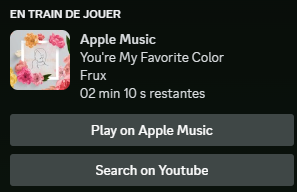

# Apple Music RPC
Apple Music RPC is a service implementation that provides a lightweight and low performance fingerprint Discord Rich Presence for Apple music.

## Installation
You can download a zip file in the release tab of this repo that contains all the files needed for te service to work.
After downloading those files, you can put them in the folder of your choice and execute it whenever you need.

If you want the service to launch at startup you can put a shortcut to it in the `shell:startup` folder using `Win + R`.

## Performances

In term of ram usage, the application will never take more than 32kb of RAM.

From my tests, I never saw the service get to 1% CPU usage.

## Inspirations
In order to make this software I took inspiration of multiple apps that were aiming to achieve the same goal as mine, but using way too much performance, or that weren't working anymore.

- [AMRPC-WatchDog](https://github.com/zephraOSS/AMRPC-WatchDog) by [Zephra](https://github.com/zephraOSS)
- [apple-music-discord-rpc](https://github.com/NextFire/apple-music-discord-rpc) by [Nam Vu (NextFire)](https://github.com/NextFire)
- [AMWin-RP](https://github.com/PKBeam/AMWin-RP) by [Vincent Liu (PKBeam)](https://github.com/PKBeam)